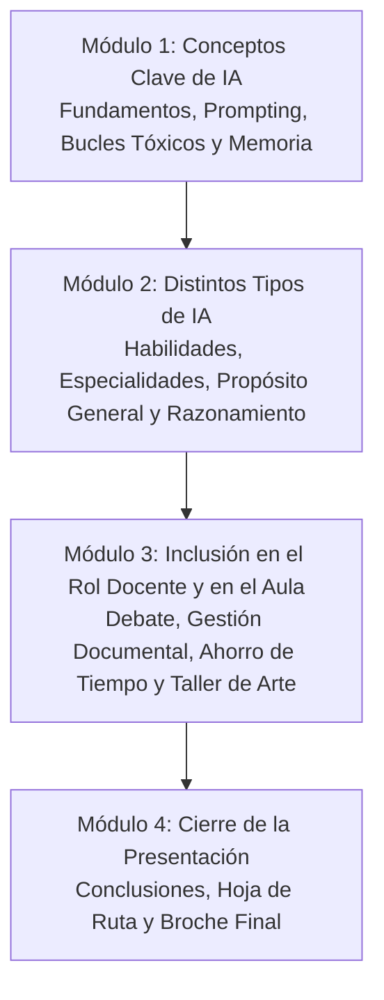
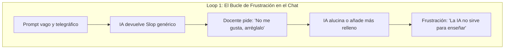
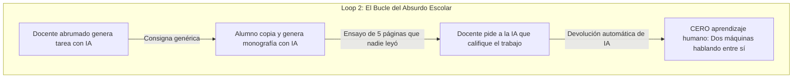

# Estructura Base para Presentación: "Inteligencia Artificial para Educadores"
> **Documento vivo de trabajo y guion metodológico**  
> **Destinatarios:** Docentes, profesores y directivos con nivel introductorio o nulo en herramientas de IA.  
> **Objetivo:** Perder el miedo, entender qué es la IA de manera práctica, descubrir dónde ya convive con nosotros, visualizar su potencial para optimizar la labor docente y aprender a comunicarse con ella eficazmente (Prompt Engineering).

---

## 📌 Ficha Resumen de la Charla

- **Título sugerido:** *De la Curiosidad a la Práctica: Inteligencia Artificial como Copiloto Docente.*
- **Enfoque:** Empático, desmitificador, accesible y 100% aplicable al aula y a la gestión educativa.
- **Tono:** Cercano, profesional, libre de jerga técnica innecesaria.
- **Duración estimada:** 50 a 60 minutos (45 min de exposición + 15 min de demostración y preguntas).
- **Idea fuerza / Mensaje ancla:**  
  > *"La IA no reemplaza al docente; un docente que sabe dialogar con la IA potenciará su tiempo y creatividad, liberándose de la rutina mecánica para enfocarse en lo que ninguna máquina puede hacer: conectar humanamente con sus alumnos."*

---

## 🧭 Estructura General de la Presentación (4 Módulos)

---

## 1. Módulo 1: Conceptos Clave de IA (Fundamentos, Prompting, Bucles Tóxicos y Memoria)

### 1.0. Dinámica de Apertura: "Desbloqueo de la Caja Negra" (Cerrojo Interactivo)
- **Recurso visual en pantalla:** Contenedor con cerrojo central y persianas de seguridad.
- **Acción del orador:** Invita a la reflexión inicial y hace clic en el cerrojo para ejecutar el barrido lateral que revela la pregunta en tipografía gigante:
  > **«¿Quiénes de nosotros hemos usado la IA... y cuántos sabemos realmente cómo funciona por dentro?»**
- **Propósito pedagógico:** Diagnosticar la experiencia del auditorio docente, bajar la ansiedad tecnológica y tender el puente directo hacia la desmitificación ("Derribando Mitos de Ciencia Ficción").

### 1.1. Lo que NO es (Derribando fantasías de ciencia ficción)
- **No es una mente consciente ni un ser que "piensa":** No tiene sentimientos, deseos ni voluntad propia.
- **No es un oráculo infalible:** No "sabe la verdad", ni entiende el mundo como lo hace una persona.
- **No es magia:** Detrás de la IA no hay misterio, sino matemáticas, patrones y enormes volúmenes de datos.

### 1.2. Lo que SÍ es (Explicación sencilla y pedagógica)
- **Concepto clave:** Modelos de lenguaje y predicción estadística.
- **Analogía comprensible:** *"Es como el autocompletar de WhatsApp, pero con la capacidad de procesar y relacionar casi toda la biblioteca de conocimiento humano."*
- **La metáfora del "asistente brillante pero acelerado":**
  - Es como un practicante o pasante recién graduado: extremadamente rápido, leyó millones de libros, pero no tiene sentido común, no conoce el contexto de tu escuela y, si no le das pautas claras, inventará respuestas para complacerte.
- **¿Qué son las "alucinaciones" y por qué ocurren?:**
  - Al ser un sistema probabilístico que busca sonar coherente antes que buscar la verdad, si no sabe algo o se le hace una pregunta ambigua, inventará datos, fechas o citas de libros con total seguridad aparente.
  - *Moraleja para el docente:* **La supervisión humana nunca es negociable.**

### 1.3. ¿Cómo funciona por dentro? Tokens, Probabilidad y Caminos Deductivos

#### A) ¿Qué es un Token y cómo se consume? (Los "bloques de Lego" de la IA)
- **La unidad de medida de la IA:** Las máquinas no leen palabras completas ni letras individuales; fragmentan todo texto en pedacitos llamados **tokens**.
  - **Regla práctica:** En promedio, **1 token ≈ 4 caracteres o 3/4 de palabra** (en español suele coincidir con sílabas, prefijos o palabras cortas).
  - *Ejemplo pedagógico:* La palabra "Educación" suele dividirse en 2 tokens: `[Educa]` + `[ción]`.
- **Consumo de tokens (Entrada vs. Salida):**
  - **Tokens de Entrada (Input):** Todo lo que tú escribes en el prompt **más todo el historial previo del chat** que el sistema le envía en silencio para que no pierda el hilo.
  - **Tokens de Salida (Output):** Cada fragmento de palabra que la IA escribe al responder.
- **La Ventana de Contexto (Límite de memoria inmediata):**
  - Cada modelo de IA tiene una capacidad máxima de tokens que puede procesar al mismo tiempo (su "memoria de trabajo").
  - Si un chat o un texto excede ese límite, la información más antigua se descarta o se olvida para hacer espacio a lo nuevo.

#### B) El esquema probabilístico: ¿Cómo genera respuestas?
- **No es un buscador de Google ni una base de datos de respuestas fijas:** La IA no tiene archivadas frases completas que copia y pega.
- **Predicción estadística del siguiente token:**
  - En cada milisegundo, la IA analiza todos los tokens previos y calcula: *"Matemáticamente, ¿cuál es el fragmento de palabra más probable que debería venir a continuación para que la frase tenga sentido y coherencia?"*
  - Lo escribe, lo suma a la frase, y vuelve a calcular la siguiente palabra.
  - **Analogía cotidiana:** Es como un músico improvisando jazz: no sabe exactamente toda la melodía de antemano, pero con base en las notas que acaba de tocar y las reglas de la armonía, deduce la siguiente nota más armónica.

#### C) Caminos deductivos (El árbol de bifurcaciones)
- Cada respuesta generada es un **recorrido por un árbol de probabilidades con infinitas ramas**:
  - Al seleccionar un token, la IA descarta otras miles de alternativas y se "compromete" con un rumbo conceptual.
  - **¿Deduce como un humano?** No con conciencia ni con lógica formal pura, sino imitando las estructuras deductivas humanas que observó en miles de millones de textos educativos y científicos.
  - **Por qué los caminos pueden fallar:** Si el prompt docente es vago, la IA puede tomar una bifurcación errónea en la primera línea y seguir descendiendo por ese camino equivocado con total convicción.
  - **El poder de guiar el camino deductivo:** Cuando le pedimos a la IA *"Piensa y justifica paso a paso antes de dar la respuesta"*, la forzamos a trazar un camino lógico visible, minimizando los errores y las alucinaciones.

### 1.4. La IA en nuestra Vida Cotidiana (Ya convivimos con ella)
1. **Chatbots de bancos y empresas de servicios:** Asistentes virtuales que atienden consultas de saldo, turnos, preguntas frecuentes (WhatsApp del banco, compañías de telefonía). Explicar la diferencia entre los bots tradicionales de opciones fijas ("Marca 1 para...") y los nuevos bots inteligentes que comprenden lenguaje natural.
2. **Plataformas de entretenimiento y streaming:** Netflix, Spotify, YouTube, TikTok. La sección *"Porque viste..."* o las listas semanales. Analizan comportamientos pasados para predecir qué te gustará después.
3. **Movilidad y navegación:** Google Maps y Waze. Predicen embotellamientos, calculan la mejor ruta en tiempo real y estiman la hora exacta de llegada cruzando millones de datos satelitales y de otros conductores.
4. **Asistentes de voz:** Siri, Google Assistant, Alexa. Conversión de voz a texto y ejecución de acciones inmediatas.
5. **En nuestro correo y teléfono:** Filtros de correo no deseado (Spam), sugerencias de texto predictivo ("Smart Compose") y fotografía computacional (modo retrato, algoritmos nocturnos).

---

### 1.5. Conceptos Fundamentales de Ingeniería de Prompt y el "Buen Prompt"

#### A) ¿Qué es un Prompt?
- Es la consigna, instrucción o texto estructurado de entrada que le proporcionamos a la IA para orientar su procesamiento probabilístico hacia un objetivo pedagógico concreto.
- No es una simple "búsqueda en internet": es un **diálogo directivo** donde se establecen condiciones, roles y expectativas.

#### B) ¿A qué se considera un "Buen Prompt"?
- **La regla de oro de la claridad docente:**
  > *"¿Un colega humano entendería con total precisión lo que acabo de pedir sin necesidad de hacerme diez preguntas previas?"*
  Si la consigna resulta ambigua para un colega, para la máquina será una lotería probabilística.
- **El prompt como acto de pensamiento pedagógico:**
  Un buen prompt no surge de improvisar frente a la pantalla en blanco; surge de haber diagnosticado previamente al grupo de alumnos, sus dificultades y el propósito didáctico exacto.
- **El flujo de 4 pasos para interactuar con IA:**
  1. **Comprender la herramienta:** Asumir el alcance probabilístico y la supervisión activa obligatoria.
  2. **Identificar la tarea exacta:** No delegar "todo el trabajo", sino una subtarea precisa (ej. crear una rúbrica analítica, adaptar un texto o diseñar una analogía).
  3. **Comunicar la instrucción con precisión:** Aplicar una estructura metódica completa.
  4. **Revisar y refinar (Iteración):** Dialogar con la máquina, ajustar detalles y pulir el resultado con criterio humano.

#### C) La Fórmula Universal: Método "R-C-T-F-R"
Una estructura metodológica para garantizar respuestas precisas y de alta calidad pedagógica:
1. **R - Rol:** ¿Quién debe ser la IA? *(Especialista curricular, docente de ciencias para primaria, orientador pedagógico).*
2. **C - Contexto:** ¿Para quién es y en qué situación? *(Edad de los alumnos, saberes previos, tiempo disponible en clase).*
3. **T - Tarea:** ¿Qué acción específica debe ejecutar? *(Diseñar 3 actividades disparadoras, adaptar un texto a lenguaje sencillo, armar una tabla de cotejo).*
4. **F - Formato:** ¿Cómo quieres la respuesta? *(Tabla de 3 columnas, lista numerada paso a paso, prosa sintética).*
5. **R - Restricciones / Criterios:** ¿Qué NO debe hacer o qué límites tiene? *(Máximo 200 palabras, sin tecnicismos complejos, sin materiales costosos).*

---

### 1.6. Problemas de no definir un buen prompt: "AI Slop" y el Bucle Tóxico de la IA

#### A) ¿Qué es el "AI Slop" (Basura o Relleno de IA)?
- **Origen del término:** Así como en internet existe el *Spam* (correo basura no deseado), hoy la comunidad tecnológica llama **Slop** a la marea de contenido generado por IA de baja calidad, masivo, genérico y sin valor real.
- **Cómo identificar el "Slop" en el ámbito educativo:**
  - **Prolijidad vacía:** Párrafos que suenan muy formales y elegantes, pero que no dicen absolutamente nada concreto.
  - **Clichés repetitivos:** Frases como *"En un mundo en constante cambio...", "Es de vital importancia destacar...", "A lo largo de los siglos..."*.
  - **Listas infinitas de obviedades:** Consejos tan genéricos que servirían igual para una clase en Tokio que para un taller en Concordia.
  - **Falta total de arraigo:** Desconexión con la realidad del aula, los tiempos escolares reales y los recursos de la escuela.
- **La Ley Básica de la IA:** *"Basura entra, basura sale" (Garbage in, Garbage out)*. Sin un contexto docente rico en el prompt, la respuesta siempre será Slop genérico.

#### B) Los 3 Bucles Tóxicos que debemos evitar

1. **Bucle 1: El Loop de la Frustración en el Chat (Micro-loop)**
   - El docente ingresa una instrucción rápida (*"Hazme una clase"*). La IA responde con un texto largo e inútil. El docente reclama *"No me gusta, cámbialo"*. Sin nuevas pautas, la IA vuelve a inventar o estirar el texto. Tras varios intentos fallidos, el docente se cansa y abandona la herramienta.
   - **Solución:** Frenar, abrir un chat nuevo y aplicar la estructura R-C-T-F-R desde cero.

2. **Bucle 2: El Loop del Absurdo Escolar (Macro-loop de simulación educativa)**
   - El profesor genera actividades mecánicas con IA, el alumno responde esas consignas pegándolas en la IA, y el profesor califica los trabajos pidiéndole a la IA que redacte la devolución.
   - **Solución:** Transformar la consigna pedagógica: evaluar el proceso, la defensa oral, el debate en clase y el criterio crítico de los alumnos en lugar de monografías fotocopiadas.

3. **Bucle 3: El Loop de la Atrofia Cognitiva**
   - Usar la IA para *no pensar* en lugar de usarla para *pensar mejor*. La delegación ciega debilita la capacidad de análisis, argumentación y síntesis del docente y del estudiante.
   - **Solución:** Tratar la IA como copiloto de borrador: la revisión crítica, el recorte ético y la decisión final son 100% humanas.

---

### 1.7. Contexto y Gestión de la Memoria del Chat

#### A) ¿Cómo funciona realmente la "memoria" de la IA?
- **Desmitificación técnica:** La IA no tiene memoria biológica ni recuerdos conscientes. No recuerda lo conversado ayer salvo que se continúe dentro del **mismo hilo de conversación**.
- **El Reenvío Silencioso del Historial:**
  Cada vez que envías un nuevo mensaje, la interfaz toma en segundo plano **todo el historial previo de ese chat** (tus mensajes anteriores y las respuestas de la máquina) y se lo vuelve a enviar al modelo como contexto de entrada. Cada mensaje nuevo obliga a la IA a releer la conversación completa.

#### B) Riesgos de una conversación interminable
- **Efecto Bola de Nieve (Consumo exponencial de tokens):**
  A medida que el chat se alarga, el volumen de tokens procesados por turno se dispara, alcanzando rápidamente el límite de la ventana de contexto.
- **Agotamiento de la Ventana de Contexto:**
  Cuando el texto acumulado es demasiado grande, el modelo comienza a descartar u "olvidar" las primeras instrucciones y pautas dadas al inicio.
- **Ancla Probabilística y Arrastre de Errores (Contaminación):**
  Si en el mismo chat se mezclaron temas de varias materias o hubo alucinaciones y desvíos intermedios, ese historial contamina las nuevas preguntas: la IA fuerza sus deducciones para coincidir con los errores pasados.

#### C) Regla de Oro de Higiene Digital: ¿Cuándo mantener y cuándo resetear?
| Decisión | Situación Concreta | Justificación Técnica |
| :--- | :--- | :--- |
| **Mantener el Chat Abierto** | Desarrollando un mismo proyecto o unidad temática coherente (ej. las 4 clases de una unidad didáctica). | La IA aprovecha las definiciones previas, objetivos y criterios ya acordados en el hilo. |
| **Iniciar un Chat Limpio (Reset)** | Al cambiar de materia, tema curricular o grupo de alumnos; o cuando la IA empiece a dar vueltas en círculos o alucinar. | Se limpia la ventana de contexto, se evita el arrastre de sesgo probabilístico y se devuelven respuestas limpias y veloces. |

---

## 2. Módulo 2: Distintos Tipos de IA (Habilidades, Especialidades, Propósito General y Razonamiento)

### 2.1. Variedad de IAs y Habilidades Actuales
- **Acciones y habilidades de los modelos contemporáneos:**
  - **Texto:** Redacción de borradores, síntesis, traducción léxica, reescritura pedagógica adaptativa y extracción de conceptos clave.
  - **Imágenes:** Comprensión visual de pizarras, diagramas manuscritos, corrección de gráficos y generación de ilustraciones visuales didácticas.
  - **Audio y Voz:** Modo de voz conversacional fluido en tiempo real, transcripción automática y clonación fonética para accesibilidad.
  - **Video:** Análisis de fotogramas, resumen de clases grabadas en video y generación de clips explicativos breves.
  - **Documentos Extensos:** Capacidad para procesar libros enteros, tesis y programas curriculares anuales completos de cientos de páginas.
- **Formatos soportados en el ecosistema educativo:**
  - Archivos de texto y documentos: `.pdf`, `.docx`, `.txt`.
  - Hojas de cálculo y datos: `.csv`, `.xlsx`.
  - Contenido audiovisual: `.jpg`, `.png`, `.mp3`, `.wav`, `.mp4`.
  - Código estructurado: `.html`, `.py`, `.js`, `.json`.

### 2.2. Especialidades de IAs según la Dimensión y Tipo de Tarea
- **Investigación académica con citas en tiempo real:** *Perplexity AI* (motor de búsqueda inteligente con enlaces directos a las fuentes consultadas).
- **Análisis de bibliografía masiva y debates en audio:** *NotebookLM* de Google (sintetiza documentos extensos y genera discusiones de audio estilo podcast educativo).
- **Arte visual y diseño gráfico de alta gama:** *Midjourney*, *FLUX* y *DALL-E 3* (narrativa gráfica, diseño de personajes y cartelería escolar).
- **Voz, narración y accesibilidad fonética:** *ElevenLabs* (voces realistas con modulación emocional) y *Whisper* (transcripción precisa de acentos).
- **Programación y desarrollo didáctico:** *Cursor*, *GitHub Copilot* y *v0* (generación de aplicaciones interactivas y código educativo).

### 2.3. Las IAs más Competitivas del Mercado: ¿IAs de Propósito General?
- **Las 3 plataformas líderes:** *ChatGPT (OpenAI)*, *Claude (Anthropic)* y *Google Gemini (Google)*.
- **¿Por qué es correcto llamarlas "IAs de propósito general"?:**
  A diferencia de las herramientas especializadas monoproducto, estos modelos integran en una única interfaz conversacional texto, visión, audio, análisis de archivos, navegación web y ejecución de código. Funcionan como asistentes polivalentes capaces de abordar casi cualquier tarea académica o pedagógica.

### 2.4. Niveles de Razonamiento en las IAs (El Caso de Google Gemini en Web y App)
- **Modo Estándar / Rápido (Gemini Flash / Flash Lite):**
  - *Mecánica:* Generación instantánea con baja latencia y respuesta fluida.
  - *Uso docente:* Búsquedas rápidas, redacción de correos, resúmenes breves, formateo de tablas y lluvia de ideas.
- **Modo Razonamiento Profundo / Pensamiento (Gemini Pro / Modo "Thinking"):**
  - *Mecánica:* La IA activa un proceso de deliberación interno antes de emitir la primera palabra (desglosa pasos lógicos intermedios invisibles).
  - *Uso docente:* Planificaciones didácticas complejas, resolución detallada de problemas matemáticos y científicos, diseño de rúbricas con descriptores observables y análisis crítico de textos contradictorios.

---

## 3. Módulo 3: Inclusión de la IA en el Rol Docente y en el Aula

### 3.1. Debate Pedagógico: La IA como Extensión de Capacidades y Andamiaje
- **Enfoque de aula frente a los alumnos:** Superar la falsa dicotomía entre prohibición estéril y fascinación acrítica.
- **La IA como prótesis / andamiaje cognitivo (Vigotsky):** No reemplaza el pensamiento, sino que permite desglosar la complejidad y superar el bloqueo de la hoja en blanco.
- **La analogía de la calculadora:** Así como la calculadora liberó al alumno del cálculo mecánico para enfocarse en la resolución de problemas, la IA absorbe la redacción mecánica preliminar para elevar la exigencia de criterio, juicio crítico y argumentación.
- **Autoría activa vs. Pereza intelectual (Slop):** Aprender a "crear con IA" (dirección creativa humana) frente a "tercerizar en la IA" (copiar y pegar sin leer).

### 3.2. Creación de Material Pedagógico y Estructuración de Documentos
- **Secuencias de clases y proyectos (ABP):** Planificación clase a clase, dosificación de unidades temáticas y diseño de Aprendizaje Basado en Proyectos (ABP) articulando múltiples materias.
- **Estructuración ágil de documentos formales administrativos:**
  - Notas de elevación a directivos y supervisores.
  - Solicitudes de presupuesto y compras de insumos para talleres de escuelas técnicas.
  - Pedidos y notas de autorización para salidas escolares y excursiones educativas (con cláusulas legales de consentimiento informado, protocolos de seguridad y teléfonos de emergencia).
  - Actas de departamento y acuerdos de convivencia.
- **Exploración y lluvia de ideas:** Analogías cotidianas para conceptos abstractos y preguntas disparadoras para abrir clases.

### 3.3. Esquema: Del Agotamiento en Pestañas y Wikipedia a la Explosión Creativa
- **Diagnóstico del problema histórico:** Pérdida de 1 a 2 horas nocturnas abriendo 20 pestañas de navegador, navegando blogs con publicidad y rebotando en Wikipedia para buscar y validar actividades.
- **El salto cualitativo con IA:** Reducción del tiempo burocrático y de búsqueda (-92% a -94%) actuando como motor de síntesis, selección y primer borrador estructurado.
- **Esquema de transferencia a la creatividad:** Cómo las horas recuperadas de la burocracia se vuelcan en dinámicas pedagógicas de alto impacto, atención personalizada a estudiantes con ritmos diversos y recuperación de la vocación docente.

### 3.4. Dinámica Interactiva: Cerrojo y Pregunta de Transición al Taller Creativo
- **Pregunta disparadora revelada tras el desbloqueo:**
  > **«Si la IA nos ahorra horas de rutina... ¿en qué invertiremos el tiempo recuperado con nuestros alumnos?»**
- **Sentido metodológico:** Tender el puente reflexivo entre el ahorro del tiempo burocrático y la entrega creativa y artística del docente y el alumno.

### 3.5. Caso Testigo: El "Personaje Fantástico" y la Analogía del Taller de Arte
- Explicación de cómo pasar de una consigna escolar habitual y el mal uso automático (AI Slop cliché) a una dirección creativa humana con rigor estético.
- Analogía del Taller de Plástica: la IA como pincel técnico y el estudiante como verdadero autor y estratega (ambientado con la ilustración botánica del personaje fantástico en técnica de acuarela).

### 3.6. El Salto Cualitativo: La Pregunta «¿POR QUÉ?», la Curiosidad y Ejemplos Disciplinares
- **La Pregunta Fundamental («¿POR QUÉ?»):**
  - Una vez asimilados los usos técnicos de la IA y el ahorro masivo de horas mecánicas (-92% a -94%), el docente debe hacerse la pregunta teleológica central: *«¿Por qué y para qué incorporamos la IA?»*.
  - No para acelerar viejas prácticas vacías, sino para dar un salto cualitativo hacia el pensamiento profundo.
- **Superación de Métodos Obsoletos:**
  - Dejar atrás la «caza de frases» en libros para responder cuestionarios fácticos básicos (tarea que hoy cualquier IA resuelve en 2 segundos sin aprendizaje).
  - Dar lugar a la creatividad, la experimentación activa y la ampliación en múltiples perspectivas y ejes temáticos.
- **Favorecer la Curiosidad Innata en un Marco Controlado:**
  - Encender la curiosidad natural del estudiante mediante 3 pilares docentes:
    1. *Norte Curricular Claro:* Objetivos pedagógicos y preguntas disparadoras bien definidas.
    2. *Filtro Crítico y Verificación:* Detección de sesgos, contraste con fuentes rigurosas y chequeo de alucinaciones.
    3. *Defensa y Metacognición Humana:* Evaluación centrada en la explicación oral del razonamiento con palabras propias.
- **Repertorio de Ejemplos Disciplinares (Proceder + Justificación Pedagógica):**
  1. *Matemáticas y Razonamiento Lógico:* Solicitar el paso a paso a la IA, explorar múltiples vías lógicas de resolución (algebraica, geométrica, gráfica) y evaluar la defensa oral del porqué de cada paso.
     - *Justificación:* La máquina calcula de inmediato; el valor irreemplazable de la mente humana está en la metacognición y en la justificación de premisas.
  2. *Historia y Ciencias Sociales:* Cargar libros digitalizados y fuentes de época en la IA para transformarla en un experto temático situado. Indagar en ejes transversales: vida cotidiana, vestimenta, arquitectura, tensiones étnicas y valores de la sociedad.
     - *Justificación:* Transforma la historia de una cronología estéril de fechas memorizadas a un laboratorio vivo de empatía histórica y pensamiento multicausal.
  3. *Lengua, Literatura y Comunicación:* Entrevistar con IA a personajes secundarios o antagonistas explorando dilemas éticos no explicitados; reescribir escenas desde perspectivas silenciadas, depurar clichés (AI Slop) y reelaborar el texto con voz de autor propia.
     - *Justificación:* Estimula la comprensión lectora profunda, la polifonía de voces y la agudeza estilística.
  4. *Ciencias Naturales y Biología:* Utilizar la IA como simulador de perturbaciones ecosistémicas (ej. cambios en el río Uruguay y sus humedales), formulando hipótesis, contrastando con informes científicos regionales y debatiendo medidas ecológicas y dilemas bioéticos.
     - *Justificación:* Fomenta el pensamiento sistémico, la indagación científica genuina y la responsabilidad ambiental situada.

---

## 4. Módulo 4: Cierre y Compromiso Institucional

### 4.1. La Labor Institucional de Fundación CONASED
- **Logo oficial de CONASED en alta definición y misión institucional.**
- **Fundación Concordiense para la Acción Social y Estudios para el Desarrollo:** El rol de la institución como articulador territorial y democratizador de la tecnología en Concordia y la región.
- **Nexo introductorio:** Puente entre la capacitación pedagógico-digital y el compromiso territorial amplio de la institución.
- **Badges de Acciones y Áreas de Trabajo Comunitario (Diseño de Alto Impacto: Ícono Destacado + Título):**
  1. *Capacitación Gratuita y Continua:* Talleres aplicados para docentes y comunidad sin costo.
  2. *Inclusión y Equidad Social:* Achicar la brecha digital con metodologías adaptables a todo contexto socioeconómico.
  3. *Acción Social y Solidaria:* Ayuda social directa, presencia territorial y articulación solidaria comunitaria.
  4. *Ética y Enfoque Humanista:* Defensa de los valores humanos y protección de las infancias en la era digital.
  5. *Eventos Comunitarios e Integración:* Jornadas públicas, festejos populares y actividades inclusivas abiertas.
  6. *Alfabetización Digital:* Formación en herramientas tecnológicas accesibles para toda la sociedad.
  7. *Talleres de Oficios y Empleo:* Trayectos de formación para la inserción y el desarrollo laboral local.
  8. *Acompañamiento Familiar:* Contención, orientación y apoyo a familias en contextos de vulnerabilidad.
  9. *Apoyo Escolar Barrial:* Espacios de refuerzo pedagógico y merenderos en barrios populares.
  10. *Deporte y Recreación Juvenil:* Promoción de actividades saludables y contención juvenil.
  11. *Salud y Bienestar Comunitario:* Jornadas de prevención, salud comunitaria y hábitos saludables.
  12. *Cultura y Participación Barrial:* Fomento del arte popular, la identidad local y la expresión comunitaria.

### 4.2. Agradecimiento a la Comunidad Educativa
- Reconocimiento explícito y sincero a los asistentes por su tiempo, calidez y compromiso con la educación.
- Homenaje en 3 dimensiones: a los docentes y profesores frente al aula, a los equipos directivos e institucionales, y a la comunidad en general.

### 4.3. Clímax de Cierre: "Muchas Gracias por su Atención"
- Composición visual de gala con tipografía cursiva estilizada (*Great Vibes*) en dorado metálico brillante con ribetes decorativos.
- Mensaje ancla de vocación y despedida: *«La tecnología abre caminos y multiplica posibilidades; pero son la mirada atenta, la paciencia y el corazón de los educadores lo que transforma las vidas de nuestros estudiantes.»*
- Sello institucional de Fundación CONASED.

